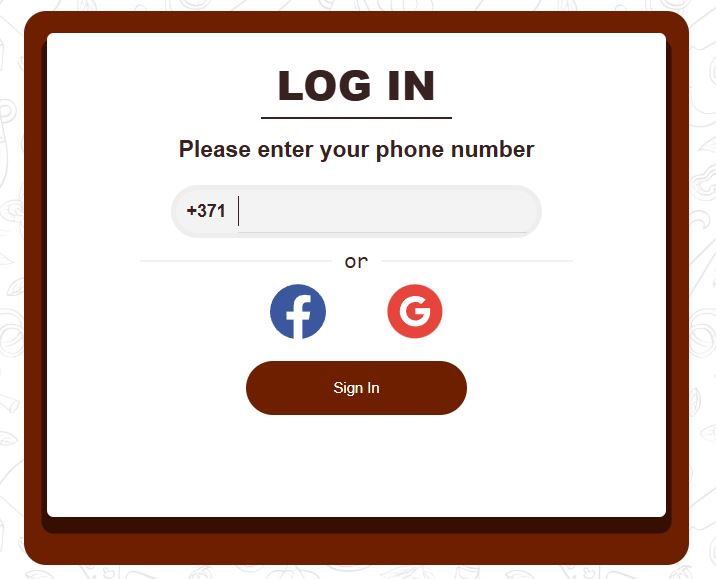
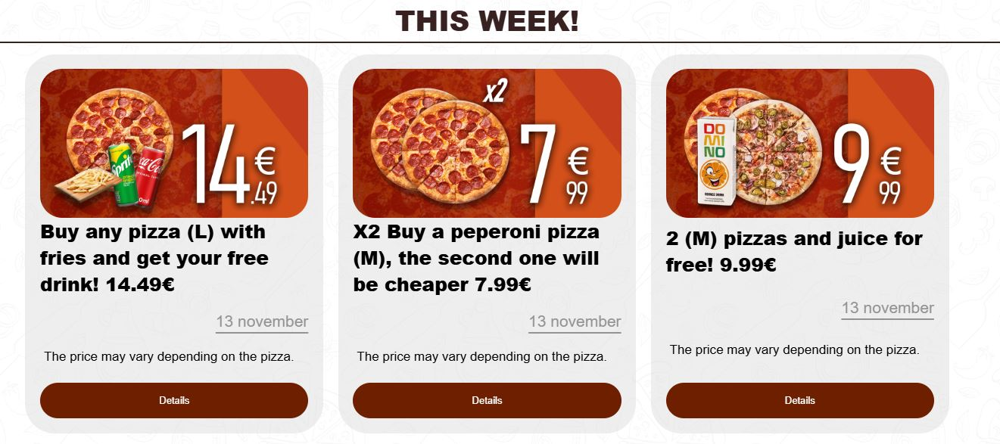
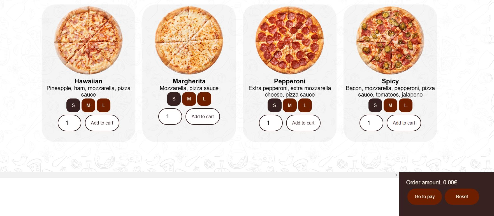
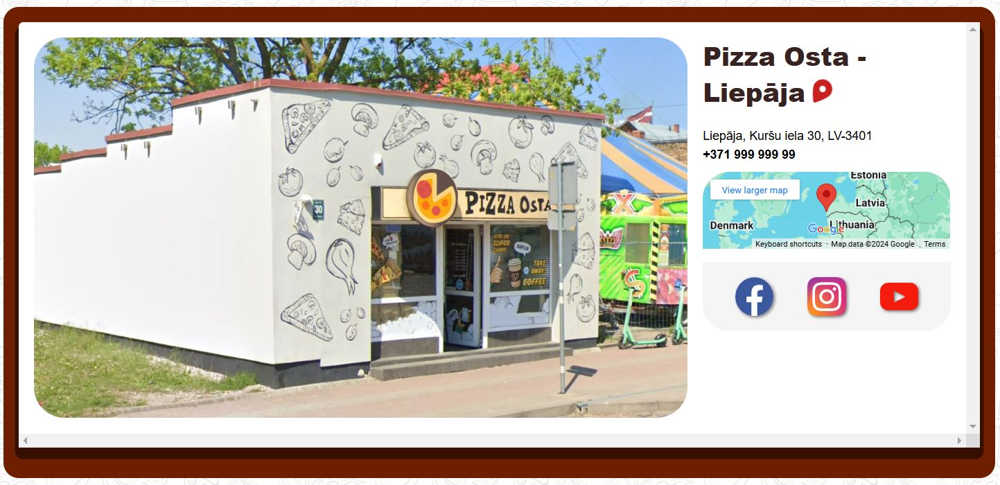

# 📖 Project: PizzaOsta

Here are the current goals, page functionality, and instructions for users.

Language selection: *[Русский](README_RU.md) ∙ [Latviešu](README_LV.md) ∙ [English](README.md)*

---

## 🚀 Current goals:

- [ ] **Adaptive Design** — interface optimization for different devices.
- [ ] **ConstructorPage** — pizza constructor functionality.
- [ ] **More products in the list** — more sections (not just Pizza)
- [ ] **LocalStorage** — storing data where it is needed.
- [ ] **Correct program build (imgs)** — customizing the collection of images and other resources.
- [ ] **UI optimization** — improving the structure and performance of styles.
- [ ] **Removing individual items from the shopping cart**.
- [ ] **Separate page with the list of offers**.
- [ ] **Rights of the admin** — adding an admin role.
- [ ] **Saving pizza layouts** — the ability to save and use the created layouts.

---

## 🔗 Navigation

There are a few page transitions at the top of the screen:

- **Log In / Sign Up** — logging into your account.
- **Offers** — discounts, promotions, raffles.
- **Order** — list of all products and create a new user order.
- **Find Us** — sales locations and contact information.
- **Constructor** — making your own pizza.

> **⚠️ Attention:** Some functionality may not correspond to the described functionality, as the project is under development. However, most of the functions described below are already available in current versions.

---

### Log In / Sign Up

After choosing one of the registration methods, a confirmation code will be sent to your phone or e-mail. Enter it to register on the site. A registered user gets access to weekly contests and faster payment.

---

### Offers

For detailed information about the offers, click **Details**. This will open a description of the offer.

---

### Order

The page consists of a list of products by category, and a shopping cart at the bottom of the screen.

#### Order creation logic:

1. Add items to the shopping cart:
   - Specify size (if available).
   - Select quantity.
   - Click **Add to cart**.
2. Click **Go to pay**:
   - **Logged user**: enter shipping location, pay.
   - **Unlogged user**: enter your phone number, delivery location, pay.

#### Extras:

- **Reset** — empties the shopping cart.
- **Minus over product** — removes a specific item.
- **Not available** — item is temporarily unavailable for ordering.
- **The pizza layout section** — ability to add a custom product to the cart.

---

### Find Us

Contact information, social media links and list of outlets.

---

### Constructor

Create a pizza with your own ingredients.

#### Functionality:

- Adding ingredients to the dough.
- Saving the pizza layout for later use.
