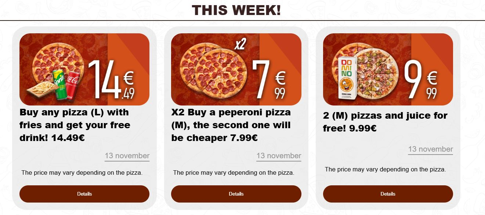
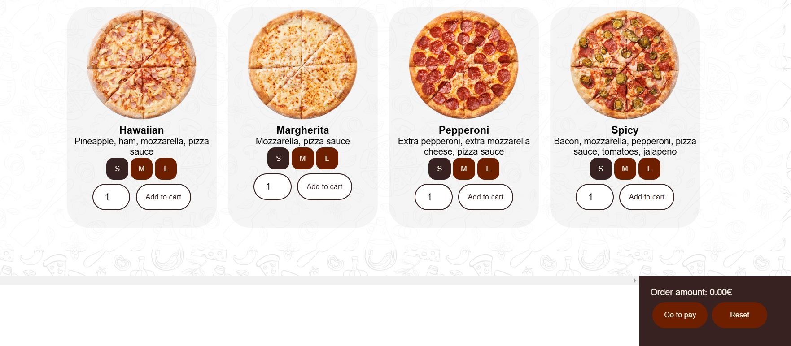
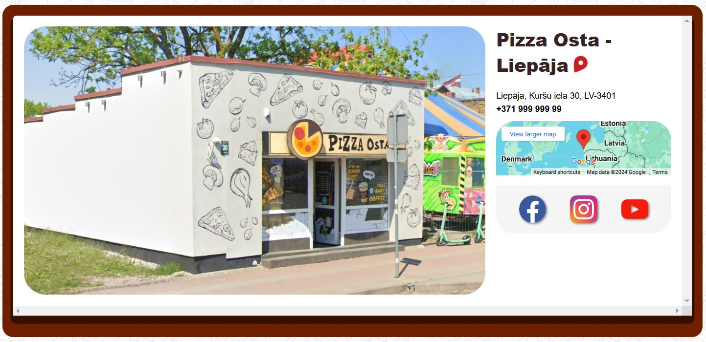

# 📖 Project: PizzaOsta

Šeit ir norādīti esošie mērķi, lapas funkcionalitāte un norādījumi lietotājiem.

Valodas izvēle: *[Русский](README_RU.md) ∙ [Latviešu](README_LV.md) ∙ [English](README.md)*

---

## 🚀 Esošie mērķi:

- [ ] **Adaptīvais dizains** — saskarnes optimizācija dažādām ierīcēm.
- [ ] **ConstructorPage** — picas konstruktora funkcionalitāte.
- [ ] **Vairāk  produktu sarakstā** — vairāk kategorijas (ne tikai Pizza).
- [ ] **LocalStorage** — datu saglabāšana tur, kur nepieciešams.
- [ ] **Pareizais programmas build (imgs)** — attēlu un citu resursu konstruēšanas pielāgošana.
- [ ] **UI optimizācija** — stilu struktūras un veiktspējas uzlabošana.
- [ ] **Atsevišķu vienumu noņemšana no iepirkumu groza**.
- [ ] **Atšķirīga lapa ar piedāvājumu (offer) sarakstu**.
- [ ] **Administrēšanas tiesības** — admin lomas pievienošana un datu pārvaldība.
- [ ] **Pica maketu glabāšana** — iespēja saglabāt un izmantot izveidotos maketus.

---

## 🔗 Navigācija

Ekrāna augšdaļā ir vairākas lapas pārejas:

- **Log In / Sign Up** — ieejot savā kontā.
- **Offers** — atlaides, akcijas, izlozes.
- **Order** — visu produktu sarakstu un izveidot jaunu lietotāja pasūtījumu.
- **Find Us** — tirdzniecības vietas un kontaktinformācija.
- **Constructor** — savas picas izgatavošana (makets).

> **⚠️ Uzmanību:** Dažas funkcijas var nebūt tādas, kā aprakstīts, jo projekts vēl tiek izstrādāts. Tomēr lielākā daļa turpmāk aprakstīto funkciju jau ir pieejamas pašreizējās versijās.

---

### Log In / Sign Up

Pēc tam, kad būsiet izvēlējies vienu no reģistrācijas metodēm, uz tālruni vai pastu tiks nosūtīts apstiprinājuma kods. Ievadiet to, lai reģistrētos vietnē. Reģistrēts lietotājs iegūst piekļuvi iknedēļas konkursiem un ātrākai apmaksai.

---

### Offers

Lai iegūtu sīkāku informāciju par piedāvājumiem, noklikšķiniet uz **Details**. Atvērsies piedāvājuma apraksts.

---

### Order

Lapu veido produktu saraksts pa kategorijām un iepirkumu grozs ekrāna apakšā.

#### Pasūtījuma izveides loģika:

1. Pievienojiet preces grozam:
   - Norādiet izmēru (ja pieejams).
   - Izvēlieties daudzumu.
   - Nospiediet pogu **Add to cart**.
2. Nospiediet **Go to pay**:
   - **Pieslēgts lietotājs**: norādiet piegādes vietu, veiciet maksājumu.
   - **Nepieslēgts lietotājs**: ievadiet tālruņa numuru, piegādes vietu, samaksājiet.

#### Turklāt:

- **Reset** — atbrīvo grozu.
- **Mīnus virs produkta** — dzēš konkrētu produktu.
- **Not available** — prece uz laiku nav pieejama pasūtīšanai.
- **Picas maketa sadaļa** — iespēja grozā pievienot pašu izveidoto produktu.

---

### Find Us

Kontaktinformācija, saites uz sociālajiem tīkliem un tirdzniecības vietu saraksts.

---

### Constructor

Izveidojiet picu no savas sastāvdaļas.

#### Funkcionalitāte:

- Sastāvdaļu pievienošana mīklai.
- Picas maketa saglabāšana turpmākai izmantošanai.
